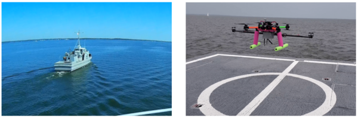

# DKF Comparisons

This repository includes codes for comparing Kalman filters that deal with delayed measurements.
The results of these comparisons are published in "Quadrotor State Estimation with IMU and Delayed Real-time Kinematic GPS" (DOI: [10.1109/TAES.2021.3061795](https://doi.org/10.1109/TAES.2021.3061795)).

## Testing the Estimator with Turbulent Wind



The proposed estimator has been tested in an ocean environment during underway tests carried out on the United States Naval Academy (USNA) research vessel YP700.
The UAV was controlled manually behind the ship by a human RC pilot, the estimator was run in real-time to observe how the proposed estimator performs under strong wind conditions that has an adverse effect on the acceleration measurements.


## Testing the Estimator with Autononous UAV Flight with RTK GPS

[](https://www.youtube.com/watch?v=PfuGb5yhlLQ)

The estimator has been also tested with autonomous flight tests using RTK GPS, which are typically delayed due to relatively longer processing time.
A video of the outdoor flight tests can be viewed here: [https://youtu.be/PfuGb5yhlLQ](https://youtu.be/PfuGb5yhlLQ).
In the video, the UAV is moving around a circle with a velocity of magnitude of 0.2 m/s, while yawing around it self.
The video compares the results of flying a UAV using the proposed estimator and a similar estimator that does not consider the delay.

## Benchmarks

Matlab codes for a total of 4 such filters are inlcuded here:
1. Alexander
  ```
  Alexander, H.L., 1991, August. State estimation for distributed systems with sensing delay. In Data Structures and Target Classification (Vol. 1470, pp. 103-111). International Society for Optics and Photonics.
  ```
2. Larsen
  ```
  Larsen, T.D., Andersen, N.A., Ravn, O. and Poulsen, N.K., 1998, December. Incorporation of time delayed measurements in a discrete-time Kalman filter. In Proceedings of the 37th IEEE Conference on Decision and Control (Cat. No. 98CH36171) (Vol. 4, pp. 3972-3977). IEEE.
  ```
3. Merwe
  ```
  Van Der Merwe, R., Wan, E. and Julier, S., 2004, August. Sigma-point Kalman filters for nonlinear estimation and sensor-fusion: Applications to integrated navigation. In AIAA Guidance, Navigation, and Control Conference and Exhibit (p. 5120).
  ```
4. **FDCL - proposed method**
  ```
  K. Gamagedara, T. Lee and M. Snyder, "Quadrotor State Estimation with IMU and Delayed Real-time Kinematic GPS," in IEEE Transactions on Aerospace and Electronic Systems, doi: 10.1109/TAES.2021.3061795.
  ```
